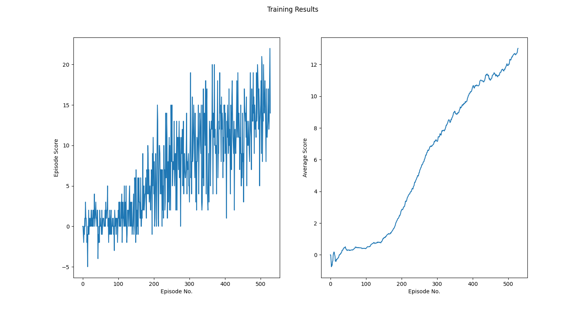

# Report
Learning algorithm used to solve environment is Dueling Double DQN.

### Adjustable hyper parameters in algorithm contains:  
  - `learning rate` - learning rate for optimizer
  - `gamma` - used for calculating q value 
  - `tau` - used for updating target model
  - `buffer size` - maximum size of replay buffer 
  - `batch size` - size of batch used for training 
  - `epsilon` - start value of epsilon used in epsilon greedy policy

### Adjusting hyper parameters
Hyper parameters used during tests:
 - `learning_rate`: [0.0002, 0.0005, 0.0008]
 - `gamma`: [0.8, 0.9, 0.99, 0.999, 1]
 - `tau`: [0.01, 0.001, 0.0001]
 - `buffer_size`: [10000, 100000]
 - `batch_size`: [64, 128, 256]
 - `epsilon`: [0.5, 1.0]

Algorithm has the highest performance when hyper parameters are set to:
 - `learning_rate`:  5e-4
 - `gamma`: 1
 - `tau`: 0.001
 - `buffer_size`: 10000
 - `batch_size`: 64
 - `epsilon`: 0.5

Agent with such hyper parameters solve environment in 329 episodes.

Maximum average score in 1000 episodes achieved by agent is 16.56.

### Training Results

### Ideas for future work
 - Implementing Prioritized Experience Replay to improve algorithm performance
 - Refactor algorithm to use raw pixel data as input